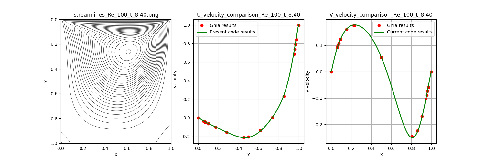
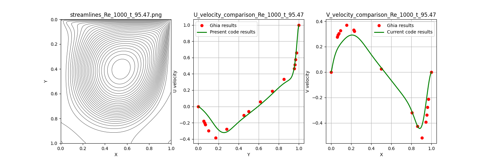
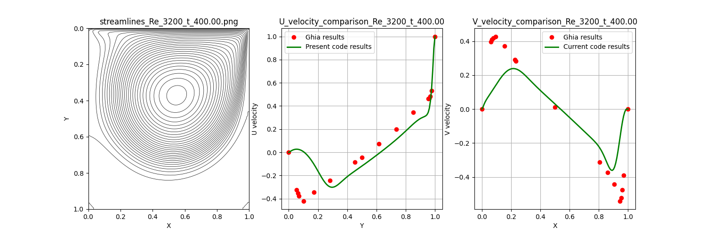

# Custom Navier-Stokes Solver: Algorithmic Stability & Validation

[](https://www.python.org/)
[](https://numpy.org/)
[](https://matplotlib.org/)
[]()

## 🚀 The Engineering Challenge
Running commercial CFD tools (like Ansys Fluent) is industry standard, but understanding the underlying numerical mathematics—specifically solver stability, truncation errors, and discretization limits—is what separates software operators from true Simulation Engineers.

This repository contains a **custom-built 2D incompressible Navier-Stokes solver** developed from scratch in Python. It solves the non-linear Vorticity-Stream Function ($\omega-\psi$) formulation. The primary objective of this project is to explicitly control **algorithmic stability** and systematically quantify **numerical diffusion** across varying inertial regimes ($Re = 100$ to $3200$).

---

## 🏗️ Core Numerical Architecture

### 1. Mathematical Formulation & Discretization
The solver translates partial differential equations into a strictly controlled algebraic matrix:
* **Vorticity Transport Equation:** Handled via an Explicit Time-Marching scheme.
* **Convective Fluxes:** Discretized using a **1st-order Upwind scheme** to prevent unphysical oscillations in highly convective flows.
* **Diffusive Fluxes:** Discretized using a **2nd-order Central Difference scheme** for accurate viscous dissipation.
* **Poisson Equation ($\nabla^2 \psi = -\omega$):** Solved iteratively using the **Jacobi method**, continuing until strict residual convergence bounds ($< 10^{-3}$) are met.

### 2. Dynamic Stability Control (CFL Implementation)
Hardcoding a time-step ($dt$) guarantees failure as the Reynolds number changes. This solver features a programmatic **Adaptive Time-Stepping algorithm**:
* Continuously calculates the maximum allowable $dt$ based on real-time maximum velocities in the domain.
* Bound by both the **Convective Courant-Friedrichs-Lewy (CFL) limit** and the **Diffusive limit** to guarantee absolute solver stability without human intervention.

---

## 📊 Rigorous Benchmarking & Physics Validation

The solver's accuracy is mathematically verified against the industry-standard benchmark dataset from **Ghia et al. (1982)**. 

*(Add your high-res image links below)*

### 1. Viscous-Dominated Regime ($Re = 100$)
Near-perfect alignment with Ghia's benchmark. The solver flawlessly captures the primary vortex topology and exact velocity boundary layers.
> 

### 2. Inertial Transition ($Re = 400$ & $1000$)
As inertia scales, the primary vortex shifts and secondary eddies form. The explicitly solved U and V velocity profiles remain highly accurate, effectively capturing the sharpening boundary layers without crashing.
> 

### 3. High Inertia & Numerical Diffusion ($Re = 3200$)
At highly inertial states, a slight deviation from the benchmark peaks is observed. **Engineering Analysis:** This successfully isolates the effect of "Numerical Diffusion" (artificial viscosity) introduced by the 1st-order Upwind scheme. It serves as a programmatic proof of why higher-order convective schemes (QUICK / 2nd-order Upwind) are mandatory for high-$Re$ industrial flows.
> 

---

## ⚙️ Execution & Performance
The solver operates headlessly and dynamically computes thousands of grid iterations until steady-state convergence is achieved. 

```bash
python Lid-Driven_Cavity.py

* Note: The solver evaluates local CFL constraints at every time step, autonomously generating performance logs (Time, Iterations, Convergence Error) and producing automated comparative visualizations upon hitting steady-state logic.
