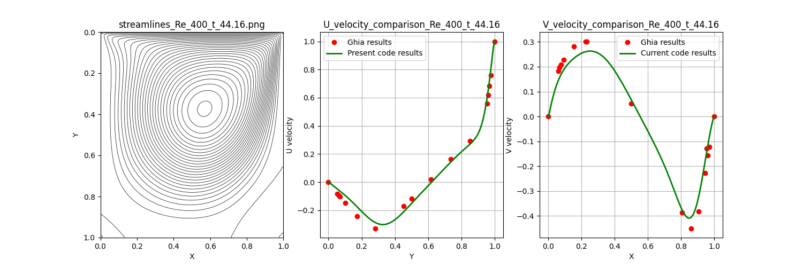

# 2D Lid-Driven Cavity Flow Solver
[](https://www.python.org/downloads/)
[](https://numpy.org/)
[](https://matplotlib.org/)

## Project Overview
This repository contains a Python-based Computational Fluid Dynamics (CFD) solver for the **2D Lid-Driven Cavity** problem. This is a standard benchmark used to validate numerical methods for the incompressible Navier-Stokes equations. 

The simulation tracks how a fluid moves inside a square cavity when the top "lid" moves at a constant velocity, creating a primary vortex and secondary eddies at higher Reynolds numbers ($Re$).

### Technical Highlights
*   **Formulation:** Vorticity-Stream Function ($\omega-\psi$) approach.
*   **Numerical Schemes:** 
    *   **Convective Terms:** 1st-order Upwind scheme (for stability).
    *   **Diffusive Terms:** 2nd-order Central Difference.
    *   **Poisson Equation:** Jacobi Iteration method.
*   **Stability:** Implements **Adaptive Time-Stepping** based on the **CFL condition**, ensuring the simulation remains stable as $Re$ changes.
*   **Validation:** Direct comparison against the benchmark data from **Ghia et al. (1982)**.

---

## Results & Validation
The following plots show the steady-state streamlines and velocity profiles across various Reynolds numbers. As $Re$ increases, we observe the center of the primary vortex shifting and the velocity gradients becoming steeper.

### 1. Reynolds Number = 100 (Laminar/Viscous Dominated)
At $Re=100$, the flow is dominated by viscosity. The solver shows near-perfect agreement with Ghia's results.


### 2. Reynolds Number = 400
As inertia increases, the primary vortex begins to shift toward the geometric center of the cavity.


### 3. Reynolds Number = 1000
The flow becomes more complex. The U and V velocity profiles remain highly accurate, effectively capturing the sharpening boundary layers.


### 4. Reynolds Number = 3200 (High Inertia)
At $Re=3200$, the flow becomes highly inertial. 

**Numerical Observation:** You will notice a slight deviation from the Ghia data at the peaks. This is a known effect of the **1st-order Upwind scheme**, which introduces "numerical diffusion." To improve accuracy at this high $Re$, a higher-order convective scheme (like QUICK or 2nd-order Upwind) or a finer grid mesh would be required.

---

## Numerical Implementation Detail
The core of the solver relies on the relationship between vorticity ($\omega$) and the stream function ($\psi$):

1.  **Vorticity Transport:**
    $$\frac{\partial \omega}{\partial t} + u \frac{\partial \omega}{\partial x} + v \frac{\partial \omega}{\partial y} = \frac{1}{Re} \nabla^2 \omega$$
2.  **Poisson Equation for Stream Function:**
    $$\nabla^2 \psi = -\omega$$
3.  **Adaptive Time-Step (CFL):**
    The time-step $dt$ is calculated dynamically to satisfy stability:
    ```python
    dt = 0.2 * min(convective_limit, diffusive_limit)
    ```

---

## Author
**Akash Mishra**
*   **LinkedIn:** [linkedin.com/in/ak587](https://linkedin.com/in/ak587)
*   **Email:** ak587mishra@gmail.com
